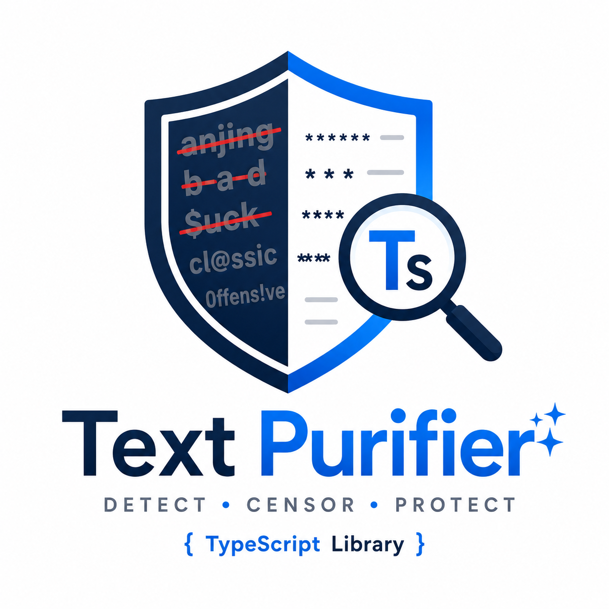

# Text Purifier


A small TypeScript library for detecting and censoring words with configurable
word lists, character aliases, whitelisting, and match metadata.

## Why Text Purifier?

- Exact matching by default to reduce false positives
- Alias normalization and separated-word detection
- Original character offsets for every match
- Zero runtime dependencies
- About 3.2 kB gzipped for the ESM build
- Works in Node.js and browsers

## Features

- Exact-word matching by default to reduce false positives
- Optional substring matching
- Character aliases such as `@` → `a` and `0` → `o`
- Detection of separated forms such as `b-a-d`
- Preserves whitespace, newlines, and surrounding punctuation
- Match offsets against the original input
- Custom censor character and runtime configuration
- TypeScript declarations, ESM, and browser UMD builds

## Installation

```bash
npm install text-purifier
```

## Upgrading from v1

Version 2 uses exact-word matching by default. To retain v1 substring matching,
set `matchMode: "substring"`. The legacy `status` field remains available, but
new code should use `detected`.

## Basic usage

```typescript
import { createTextPurifier } from "text-purifier";

const purifier = createTextPurifier();

const detection = purifier.detect("Hello anjing");
console.log(detection.detected); // true
console.log(detection.matches[0].word); // "anjing"

const censored = purifier.censor("Hello anjing!");
console.log(censored.censoredText); // "Hello ******!"
```

`createFilter()` is also exported as a shorter alias for
`createTextPurifier()`.

## Results

`detect()` returns only detection data:

```typescript
{
  detected: true,
  matches: [
    {
      word: "anjing",
      normalized: "anjing",
      start: 6,
      end: 12
    }
  ]
}
```

`censor()` returns the same detection data plus an unambiguous
`censoredText` field. For clean input, `censoredText` contains the original
text.

```typescript
{
  detected: true,
  censoredText: "Hello ******!",
  matches: [/* ... */]
}
```

## Configuration

```typescript
const purifier = createTextPurifier({
  banWords: ["bad", "word"],
  whitelist: ["allowed"],
  characterMap: {
    "@": "a",
    "4": "a",
    "$": "s",
    "0": "o"
  },
  matchMode: "exact",
  censorCharacter: "*"
});
```

Default banned words are stored in separate language dictionaries:

- `ban-words/en.json`
- `ban-words/id.json`

All dictionaries are enabled by default. Use `languages` as an allowlist to
select only the languages that should be filtered:

```typescript
const indonesianPurifier = createTextPurifier({
  languages: ["id"]
});
```

Use `excludeLanguages` as a denylist when you want to enable all languages
except specific ones:

```typescript
const nonEnglishPurifier = createTextPurifier({
  excludeLanguages: ["en"]
});
```

When both options contain the same language, `excludeLanguages` takes
precedence. Custom `banWords` still replaces the selected built-in
dictionaries. The raw dictionaries can also be imported from
`text-purifier/ban-words/en.json` and `text-purifier/ban-words/id.json`.

Providing `banWords` or `characterMap` replaces the corresponding default
value for that filter instance. Configuration objects are cloned, so runtime
updates do not mutate the values supplied by the caller.

### Match modes

The default `exact` mode avoids matching a banned word inside an otherwise
valid word:

```typescript
const purifier = createTextPurifier({ banWords: ["ass"] });
purifier.detect("classic").detected; // false
```

The previous substring behavior is available explicitly:

```typescript
const purifier = createTextPurifier({
  banWords: ["ass"],
  matchMode: "substring"
});

purifier.detect("classic").detected; // true
```

### Runtime updates

```typescript
const purifier = createTextPurifier();

purifier.addBanWords(["custom"]);
purifier.addWhitelistWords(["allowed"]);
purifier.addCharacterMap({ "3": "e" });
```

## How it works

Detection scans non-whitespace tokens while retaining their positions in the
original string. Each token is lowercased, Unicode accents are normalized,
configured character aliases are applied, and internal separators are removed.
Exact mode then performs a normalized `Set` lookup. Matches keep their original
start and end offsets, so censoring can rebuild the text without changing
unmatched whitespace or punctuation.

Substring mode uses the same normalization and offset tracking, but checks
whether a configured word occurs inside each normalized token.

## Performance

The included benchmark compares censoring against
[`bad-words` 4.1.5](https://www.npmjs.com/package/bad-words) using the same
one-word dictionary. Results are the median of five samples on Bun 1.3.5,
Linux x64, and an Intel Core i5-13450HX:

| Input | text-purifier | bad-words |
| ---: | ---: | ---: |
| 100 words | 8,048.5 ops/s | 6,117.3 ops/s |
| 1,000 words | 869.8 ops/s | 570.4 ops/s |
| 10,000 words | 91.0 ops/s | 61.9 ops/s |

Run it on your own hardware with:

```bash
npm run benchmark
```

Benchmark results vary by runtime, hardware, dictionary size, and input shape.
The benchmark source is in
[`benchmark.ts`](https://github.com/dipras/text-purifier/blob/main/benchmark.ts).

## API

### `createTextPurifier(config?)`

Creates an isolated purifier. `createFilter(config?)` is an equivalent short
alias. Available configuration:

- `banWords: string[]`
- `languages: ("en" | "id")[]`
- `excludeLanguages: ("en" | "id")[]`
- `characterMap: Record<string, string>`
- `whitelist: string[]`
- `matchMode: "exact" | "substring"`
- `censorCharacter: string` — exactly one Unicode code point

### `detect(text)`

Returns `{ detected, matches }` without changing the input.

### `censor(text)`

Returns `{ detected, censoredText, matches }`. Matched content is replaced
while surrounding formatting is preserved.

### `addBanWords(words)`

Adds words to the current filter instance.

### `addWhitelistWords(words)`

Adds exact normalized words that should not be matched.

### `addCharacterMap(mappings)`

Adds or replaces character aliases and rebuilds the normalized word lists.

### Deprecated API

`createBadWordFilter()` and `filterText(text, censor?)` remain available for
backward compatibility. New code should use `createTextPurifier()` with
`detect()` or `censor()` so return fields and intent remain explicit.

## Development

```bash
npm ci
npm test
npm run build
npm run benchmark
```

The test scripts use [Bun](https://bun.sh/) 1.3.5.

## License

[GPL-2.0-only](LICENSE)
